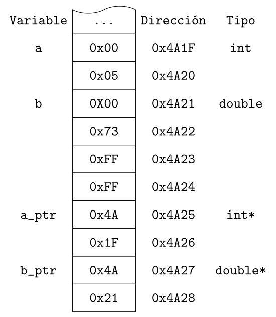
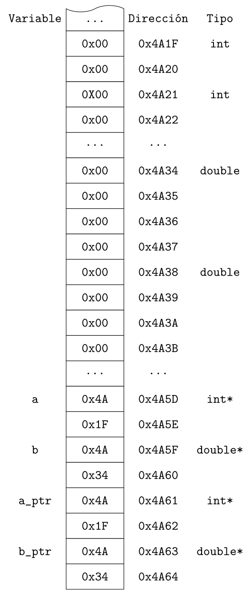

# Punteros en C y C++

Ref. [code1C](https://github.com/RieraULL/AED-ULL/blob/master/code1/pointer1.c)
Ref. [code1CPP](https://github.com/RieraULL/AED-ULL/blob/master/code1/pointer1.cpp)

Ref. [code2C](https://github.com/RieraULL/AED-ULL/blob/master/code1/pointer2.c)
Ref. [code2CPP](https://github.com/RieraULL/AED-ULL/blob/master/code1/pointer2.cpp)

Ref. [code3C](https://github.com/RieraULL/AED-ULL/blob/master/code1/pointer3.c)
Ref. [code3CPP](https://github.com/RieraULL/AED-ULL/blob/master/code1/pointer3.cpp)

Ref. [code4C](https://github.com/RieraULL/AED-ULL/blob/master/code1/pointer4.c)
Ref. [code4CPP](https://github.com/RieraULL/AED-ULL/blob/master/code1/pointer4.cpp)

Ref. [code5C](https://github.com/RieraULL/AED-ULL/blob/master/code1/pointer5.c)
Ref. [code5CPP](https://github.com/RieraULL/AED-ULL/blob/master/code1/pointer5.cpp)

Ref. [code6CPP](https://github.com/RieraULL/AED-ULL/blob/master/code1/func1.cpp)

Ref. [code7CPP](https://github.com/RieraULL/AED-ULL/blob/master/code1/func2.cpp)

## Introducción

Los punteros son extremadamente potentes porque le permiten acceder a direcciones de memoria y manipular sus contenidos. Pero también son extremadamente complejos de manejar. Utilizándolos correctamente, podrían mejorar en gran medida la eficiencia y el rendimiento de nuestros porgrams. Por otro lado, su uso incorrecto podría dar lugar a muchos problemas, desde códigos no legibles, hasta errores difíciles de detectar y corregir, como pérdidas de memoria y accesos incorrectoas a memoria, que pueden exponer el sistema a la piratería. Muchos lenguajes nuevos (como Java y C#) eliminan el puntero de su sintaxis para evitar las *trampas* inherentes a este mecanismo, proporcionando administración de memoria automática.

Cada posición de memoria tiene una *dirección* y contiene un dato. La dirección es un número (a menudo expresado en hexadecimal), que puede ser tediosa y difícil de usar por los programadores. Dependería exclusivamente del programador interpretar el significado de los datos, como números enteros, números reales, caracteres o cadenas.

Para facilitar la programación cuando se utiliza la dirección numérica, los primeros lenguajes de programación introdujeron el concepto de variables. Una variable es una ubicación con nombre que puede almacenar un valor de un tipo particular. Así, se asocian nombres (o *identificadores*) a ciertas direcciones. Además, el mecanismo de las variables hace que se asocien también a los contenidods de memorias tipos de datos (como `int`, `double`, `char`) para facilitar la interpretación de los datos.

Una variable de puntero (o puntero) es básicamente una variable normal que pueden almacenar un dato. A diferencia de la variable normal que almacena un valor (como un `int`, un `double`, o un `char`), un puntero almacena una dirección de memoria.

Veamos un ejemplo en la siguiente figura.

La figura muestra un conjunto de celdas consecutivas que representan la memoria. Cada una de las celdas puede almacenar una valor (en este caso, a efectos de ilustración, una palabra de ocho bits). Ademas, cada celda tiene asocidada una dirección (que a efectos de ilustración, es de dieciséis bits). Los compiladores permiten que este mecanismo de bajo nivel sea transparente al programador, permitiendo el uso de tipos de datos y variables. 

En la ilustración se define una variable `a` de tipo `int`. En este ordenador imaginario el tipo `int`requiere dos celdas de ocho bits. Además, se define la variable `b` de tipo `double`. Este compilador imaginario requiere cuatro palabras de ocho bits para definir un tipo `double`. 

El fragmento de programa que se muestra a continuación representa la definición de estas dos variables en lenguaje C++. Además, en un momento posterior se le asignan los valores `5` a la variable `a`, y `12.6` a la variable `b`. El valor `5` decimal se almacenará en `a` como el número hexadecimal `0x0005` en la celda de memoria definidas al efecto. Por otro lado, el número decimal `12.6` se almacenará siguiendo un formato de número real que nos inventamos: una *mantisa* de `126` (`0x0073` en hexadecimal), y un *exponente* de `-1` almacenado como `0xFFFF` en complemento a dos.   

~~~cpp
int main(void){
	
 	int    a;
 	double b; 
 
 	int    *a_ptr = NULL; 
 	double *b_ptr = NULL;
 		
 	a = 5;
	b = 12.6; 
	
	a_ptr = &a; 
	b_ptr = &b; 

	cout << setw(4) << a << setw(16) <<  a_ptr << endl; 
	cout << setw(4) << fixed << setprecision(1) << b << setw(16) <<  b_ptr << endl; 
	cout << setw(4) << a << setw(16) << *a_ptr << endl;
	
	return 0;
}
~~~

En el fragmento de código se definen dos variables de tipo puntero `a_ptr` y `b_ptr`. Nótese que es importante definir el tipo de dato al que apuntan las variables puntero (`int` y `double` respectivamente), para facilitar el acceso posterior a los datos. Estas dos variables puntero se almacenan igual que otra variable, aunque su contenido va a se direcciones de memoria.  

Cuando se declara una variable puntero, su contenido no se inicializa. En otras palabras, contiene una dirección *basura*, que por supuesto no es una dirección válida. ¡**Esto es muy peligroso**! Debe inicializarse un puntero asignándole una dirección válida. Esto normalmente se realiza a través del operador de dirección (`&`), o asignándole el puntero nulo `NULL`.

El operador de *dirección* (`&`) opera en una variable y devuelve la dirección de la variable. Por ejemplo, si `a` es una variable `int`, `&a`devuelve la dirección de memoria de la variable.

El operador de *indirección* (o de *desreferenciación*) (`*`) opera en un puntero y devuelve el valor almacenado en la dirección guardada en la variable d puntero. Por ejemplo, si `a_ptr` es un puntero a `int`, `*a_ptr` devuelve el valor `int` apuntado `a_ptr`.

En el ejemplo ficticio de la figura anterior, vemos que el puntero `a_ptr` se encuentra en la dirección `0x4A25` y su contenido es la dirección de la variable `a` (`0x4A1F`). Mientras que el puntero `b_ptr` se encuentra en la dirección `0x4A27`, y almacena la dirección `0x4A21`, es decir, la celda donde se encuentra la variable `b`. 

## Vectores y punteros

Los vectores, tal y como los conocemos en C++ resultan ser punteros a regiones de memoria en la que se almacena un bloque de memoria homogénea. Por ello, podemos acceder a sus elementos utilizando la notación de índice con los símbolos `[]` o mediante aritmética de punteros.

En suma, el nombre de un vector es un puntero que apunta al primer elemento (índice 0) de éste. Por ejemplo, supongamos que `a` es un vector de `int`, `a` es también un puntero `*int`, apuntando al primer elemento del vector. Es decir, `a` es lo mismo que `&a[0]`. En consecuencia, `*a` es  `a[0]`; `*(a + i)` es  `a[i]`.

El siguiente fragmento de código muestra cómo los vectores definidos en C++ son en realidad punteros que apunta al comienzo de una región de memoria que ha sido reservada para almacenar datos uniformes.

~~~cpp
int main(void){
	
	int    a[MAXIMO];
 	double b[MAXIMO]; 
 	
	int    *a_ptr = NULL; 
 	double *b_ptr = NULL;
 	
 	a_ptr = a;
 	b_ptr = b;
	
	for(int i = 0; i < MAXIMO; i++)
	{
		a[i] = i;
		b[i] = i + 0.5;
	}

	for(int i = 0; i < MAXIMO; i++)
	{	
		cout << setw(4) << a[i] << setw(4) << *(a_ptr + i) << endl; 
		cout << setw(4) << a_ptr[i] << setw(4) << *(a + i) << endl; 
	}

	return 0;
}
~~~

Como se puede ver en el código anterior, se definen dos variables `a`y `b` como dos vectores de tamaño `MAXIMO`. Seguidamente se declaran dos variables tipo puntero `a_ptr` y `b_ptr`. A continuación se asigna `a` a `a_ptr` y  `b` a `b_ptr`. Esta asignación es posible porque los vectores en C++ son en realidad punteros. A continuación se rellenan ambos vectors con cierto contenido. 

El último bucle, en el que se recorren las estructuras para mostrar su contenido, se puede ver cómo se puede acceder a los elementos del vector utilizando la notación de punteros. Es decir, acceder a la posición `i` del vector a puede hacerse de dos maneras: 

- `a[i]`
- `*(a + i)`

El siguiente fragmento de código modifica el el contenido de un vector ¿Sabrías de antemano qué se va a mostrar por pantalla?

~~~cpp
int main(void){
	
	int numbers[MAXIMO];
 	
	int *p = NULL; 
	
	p = numbers;     *p = 10; 
	p ++;            *p = 20; 
	p = &numbers[2]; *p = 30; 
	p = numbers + 3; *p = 40; 
	p = numbers;     *(p+4) = 50;

	for(int i = 0; i < MAXIMO; i++)
		cout << setw(4) << numbers[i] << endl;				
}
~~~

## Punteros a funciones
Un recurso muy sofisticado y que puede hacer nuestros procesos selectivos elegantes (evitando la claúsula `switch` `case`) es el uso de punteros a funciones. Los punteros a funciones permiten utilizar funciones como parámetros de otras funciones, o incluso, como elemento de un vector de punteros a funciones.

A continuación se muestran dos ejemplos. 

~~~cpp
typedef int (*opera_ptr)(int, int);
 
int suma (int n1, int n2) { return n1 + n2; }
int rest (int n1, int n2) { return n1 - n2; }
int mult (int n1, int n2) { return n1 * n2; }
int div  (int n1, int n2) { return n1 / n2; }
 
int opera(int n1, int n2, opera_ptr operador) 
{
   return (*operador)(n1, n2);
}
 
int main(void) 
{
   const int a = 10, b = 5;
 
   cout << opera(a, b, suma)  << endl;
   cout << opera(a, b, rest)  << endl;
   cout << opera(a, b, mult)  << endl;
   cout << opera(a, b, div )  << endl;
}
~~~

En este primer ejemplo, se define un nuevo tipo de dato a través de `typedef`. Se trata de un tipo de dato puntero a una función que devuelve un entero, y tiene como parámetros dos enteros (estúdiese con detalle la sintáxis). Seguidamente se definen e implementas cuatro funciones que cumplen con los requisitos del nuevo tipo de dato definido previamente. Seguidamente se define e implementa una función (`opera`), a la cual, entre otros, se le pasa como parámetro un puntero a una función (el nombre de una función). La implementación de esta función lleva a cabo una llamada a la función que se pasa como parámetro. Finalmente, el programa principal invoca a la función `opera` con las cuatro funciones parámetro definidas anteriormente.

~~~cpp
typedef int (*opera_ptr)(int, int);
 
int suma (int n1, int n2) { return n1 + n2; }
int rest (int n1, int n2) { return n1 - n2; }
int mult (int n1, int n2) { return n1 * n2; }
int div  (int n1, int n2) { return n1 / n2; }
 

int opera(int n1, int n2, opera_ptr operador) 
{
   return (*operador)(n1, n2);
}
 
int main(void) 
{
   opera_ptr opera_array[] = {suma, rest, mult, div};

   const int a = 10, b = 5;

   for(size_t i = 0; i < N_OP; i++)
		cout << opera(a, b, opera_array[i]) << endl;
}
~~~

El segundo ejemplo incluye la definición de un vector de punteros a funciones (`opera_array`). Véase la flexibilidad que produce el uso de estos vectores, incluso en la definición de un menú. ¿Cómo lo implementarías?

## Operadores `new` y `delete`

En lugar de definir una variable `int` y asignar la dirección de la variable puntero `a_ptr` (`a_ptr = &a`), el almacenamiento puede asignarse dinámicamente en tiempo de ejecución, a través del operador `new`. En C++, cada vez que asigna un fragmento de memoria dinámicamente a través de `new`, de debe eliminar después de usar, (es decir, debe liberarse la memoria).

El operador `new` devuelve un puntero a la memoria reservada. El operador `delete` toma un puntero (que está apuntando a una región de memoria asignada a través de `new`) como único argumento.

El siguiente fragmento de código muestra dos ejemplos de utilización los operadores `new`y `delete`, en caso de que definamos un vector, o una variable individual. ¿Podrías advertir la diferencia en ambos casos?

~~~cpp
int main(void){
 		
	int a[MAXIMO];
	
	int *a_ptr = NULL; 
	int *b_ptr = NULL;

	a_ptr = new int [MAXIMO];
	b_ptr = new int;

	*b_ptr = 5;

	for(int i = 0; i < MAXIMO; i++)
	{
		a[i] = i;
		a_ptr[i] = i;
		cout << setw(4) << a[i] << setw(4) << a_ptr[i] << endl;
	}

	cout << setw(4) << *b_ptr << endl;
			
	delete [] a_ptr;	
	a_ptr = NULL;

	delete b_ptr;
   	b_ptr = NULL;
}
~~~

## Recursos

- http://www.cplusplus.com/doc/tutorial/pointers/
- https://www.ntu.edu.sg/home/ehchua/programming/cpp/cp4_PointerReference.html
- http://en.cppreference.com/w/cpp/language/pointer

